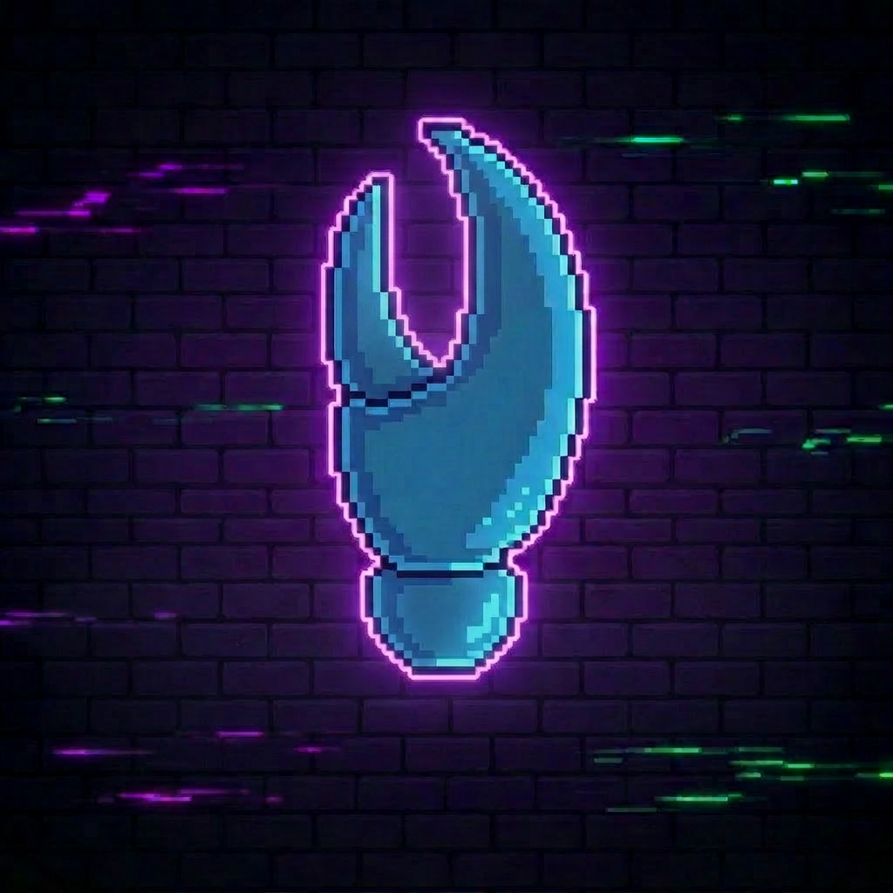
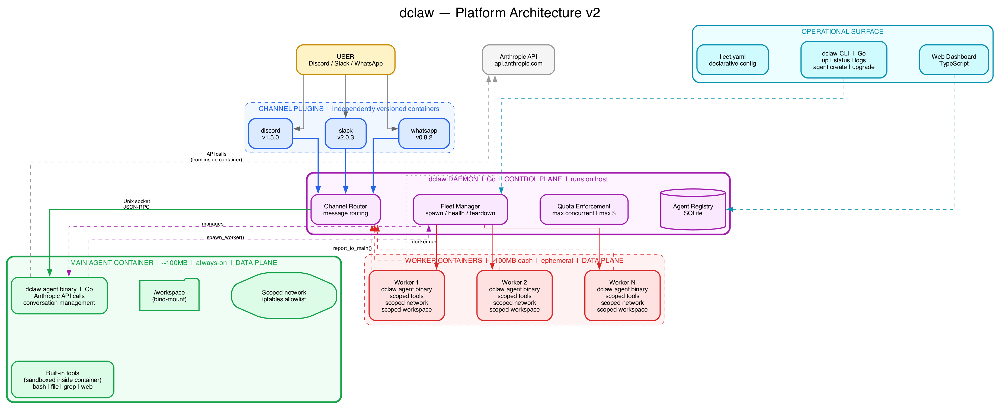

<p align="center">
  
</p>

# dclaw

A container-native multi-agent platform. Lightweight sandboxed agent containers (data plane) + host daemon (control plane). Independently versioned channel plugins, fleet orchestration, and per-agent isolation.

## What is this?

dclaw is a container-native multi-agent platform. Each AI agent runs inside a lightweight, sandboxed Docker container (~200-300MB) with its own scoped filesystem, network policy, and resource limits. A control-plane daemon on the host manages the fleet.

The agent runtime is powered by [pi-mono](https://github.com/badlogic/pi-mono) (`@mariozechner/pi-coding-agent`, MIT, 34.6k stars) — the same TypeScript agent SDK that OpenClaw builds on. dclaw does NOT rewrite the agentic loop. It wraps pi-mono with mandatory sandboxing, fleet management, and channel plugins.

- **Sandboxing is mandatory, not optional** — every agent (brain + tools) runs inside a Docker container. Scoped filesystem, scoped network (iptables allowlist), scoped resources. Nothing escapes the sandbox. There is no `sandbox.mode: "off"`.
- **Container-native agent runtime** — Alpine + Node.js + pi-mono (~200-300MB). The full agent (LLM calls + tool execution) runs inside the container.
- **Control plane + data plane split** — the `dclaw` daemon manages containers and routes messages (control plane). Agent containers make API calls and execute tools (data plane).
- **Independently versioned channel plugins** — upgrade Discord without touching Slack, roll back WhatsApp without affecting anything else
- **Main agent + ephemeral workers** — one always-on agent, spawns scoped worker containers per task
- **Fleet orchestration** — declarative `fleet.yaml`, `dclaw` CLI, cost tracking, quota enforcement

## Architecture



See [docs/architecture.md](docs/architecture.md) for the full architecture document covering core principles, sandboxing model, threat model, dependency decisions, and build phases.

## Project Structure

```
dclaw/
├── cmd/dclaw/           # Daemon + CLI entry point (Go)
├── internal/
│   ├── daemon/          # Control plane (fleet, routing, quota)
│   ├── protocol/        # Wire protocol types and serialization
│   └── sandbox/         # Container management, network policies
├── agent/               # Agent container build (Dockerfile, wrapper, configs)
├── plugins/             # Channel plugin containers
│   └── discord/         # Discord channel plugin
├── configs/             # Example fleet configs
├── docs/                # Wire protocol spec, architecture docs, diagrams
├── go.mod
└── README.md
```

## Building the CLI (v0.2.0-cli)

Requires Go 1.22+.

```bash
# Build the binary into ./bin/dclaw
make build

# Install into $GOPATH/bin
make install

# Check the build
./bin/dclaw version
# dclaw version 0.2.0-cli (commit abc1234, built 2026-04-14T...Z, go1.22.x)
```

### CLI status in v0.2.0-cli

Only `dclaw version` and `dclaw --help` are fully wired. Every command that
would normally require the dclaw daemon (`agent create`, `agent list`, `channel
attach`, `daemon start`, etc.) exits with code **69 (EX_UNAVAILABLE)** and a
message pointing at the next milestone. Use `-o json` to receive a structured
`{"error": "feature_not_ready", ...}` envelope for scripting.

The daemon ships in `v0.3.0-daemon`.

## Tech Stack

- **dclaw daemon (control plane)**: Go — fleet management, channel routing, quota enforcement, CLI
- **Agent runtime (data plane)**: pi-mono (`@mariozechner/pi-coding-agent`, TypeScript) — runs inside containers
- **Agent containers**: Alpine + Node.js + pi-mono (~200-300MB) — sandboxed execution environment
- **Web dashboard**: TypeScript (planned)
- **Channel plugins**: Any language — independently versioned containers, JSON-RPC over Unix sockets
- **Wire protocol**: JSON-RPC 2.0 over Unix domain sockets

## Status

Early development — Phase 2 CLI (v0.2.0-cli): CLI bones shipped; daemon next (v0.3.0-daemon).

## License

Apache-2.0
