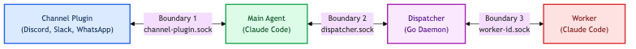
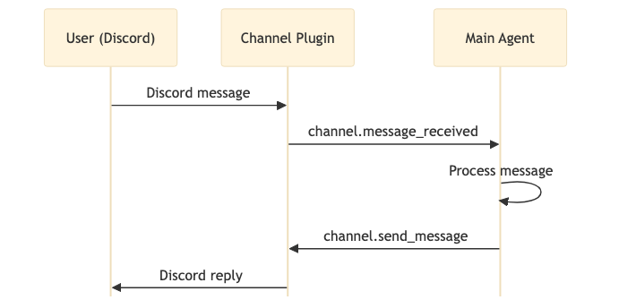
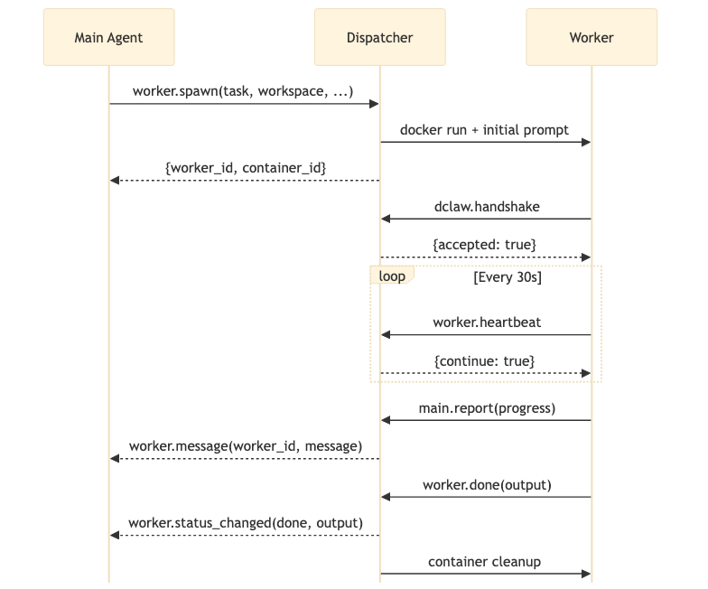
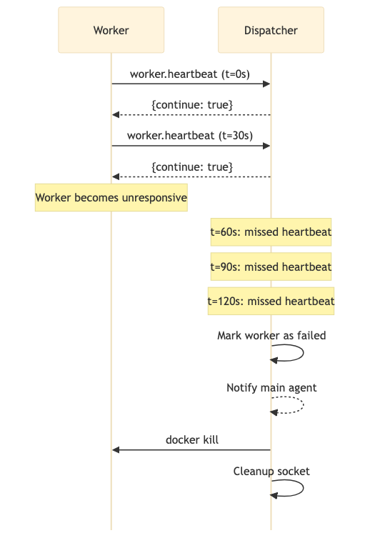
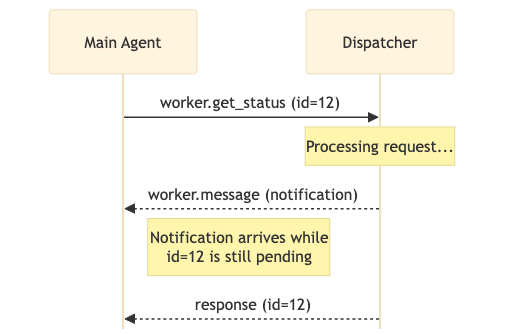
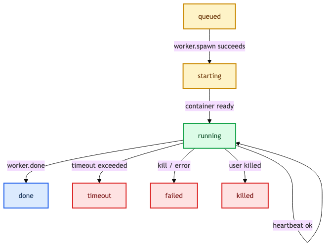

# dclaw -- Wire Protocol Specification v1

| Field             | Value                    |
|-------------------|--------------------------|
| **Version**       | 1                        |
| **Status**        | Draft                    |
| **Date**          | 2026-04-11               |
| **Transport**     | Unix Domain Sockets      |
| **Encoding**      | JSON-RPC 2.0 over UTF-8  |
| **Max Message**   | 1 MB                     |

---

## Table of Contents

1. [Overview](#1-overview)
2. [Transport Layer](#2-transport-layer)
3. [Envelope Format (JSON-RPC 2.0)](#3-envelope-format-json-rpc-20)
4. [Versioning and Handshake](#4-versioning-and-handshake)
5. [Boundary 1: Channel Plugin <-> Main Agent](#5-boundary-1-channel-plugin--main-agent)
6. [Boundary 2: Main Agent <-> Dispatcher](#6-boundary-2-main-agent--dispatcher)
7. [Boundary 3: Worker <-> Dispatcher](#7-boundary-3-worker--dispatcher)
7a. [Boundary 4: CLI <-> Daemon](#7a-boundary-4-cli--daemon)
8. [Error Codes](#8-error-codes)
9. [Heartbeat and Liveness](#9-heartbeat-and-liveness)
10. [Message Size Limits](#10-message-size-limits)
11. [Concurrency Model](#11-concurrency-model)
12. [Quick Reference](#12-quick-reference)

---

## 1. Overview

dclaw is a container-native multi-agent platform. Its architecture comprises four component types:

| Component           | Description                                                        | Lifecycle       |
|---------------------|--------------------------------------------------------------------|-----------------|
| **Main Agent**      | Always-on container running pi-mono. Coordinates all work.         | Long-lived      |
| **Worker Agent**    | Ephemeral container running pi-mono. Executes a scoped task.       | Task-scoped     |
| **Channel Plugin**  | Independently versioned container. Bridges a messaging platform.   | Long-lived      |
| **Dispatcher**      | Go binary daemon. Manages the worker fleet.                        | Long-lived      |

All inter-component communication travels over **Unix domain sockets** using **JSON-RPC 2.0** messages encoded as UTF-8.

There are three core agent-architecture communication boundaries, each with its own socket and message set. A fourth boundary (CLI <-> Daemon) was added in v0.3 for host-side control; it is dclaw-specific and documented separately in Section 7a:



---

## 2. Transport Layer

### Socket Paths

Each communication boundary uses a dedicated Unix domain socket. All sockets reside in user-owned runtime directories; no sudo required.

| Boundary                      | Socket Path Pattern (Linux)                                      | Socket Path Pattern (macOS)                    | Creator     |
|-------------------------------|------------------------------------------------------------------|------------------------------------------------|-------------|
| CLI <-> Daemon                | `$XDG_RUNTIME_DIR/dclaw.sock` (fallback `~/.dclaw/dclaw.sock`)   | `~/.dclaw/dclaw.sock`                           | Dispatcher  |
| Channel Plugin <-> Main Agent | `$XDG_RUNTIME_DIR/dclaw-channel-<plugin_name>.sock`              | `~/.dclaw/channel-<plugin_name>.sock`          | Main Agent  |
| Main Agent <-> Dispatcher     | `$XDG_RUNTIME_DIR/dclaw-dispatcher.sock` (fallback `~/.dclaw/dispatcher.sock`) | `~/.dclaw/dispatcher.sock`          | Dispatcher  |
| Worker <-> Dispatcher         | `$XDG_RUNTIME_DIR/dclaw-worker-<worker_id>.sock`                 | `~/.dclaw/worker-<worker_id>.sock`             | Dispatcher  |

- The **Dispatcher** creates the CLI-facing socket and the main dispatcher socket at startup.
- The **Dispatcher** creates a per-worker socket at spawn time and bind-mounts it into the worker container.
- The **Main Agent** creates per-channel-plugin sockets when channel plugins register.

All sockets are owned by the invoking user (no root, no `/var/run/`). On Linux, `$XDG_RUNTIME_DIR` is the preferred location (typically `/run/user/<uid>/`); if it is unset, the daemon falls back to `~/.dclaw/`. On macOS, sockets always live under `~/.dclaw/` because `XDG_RUNTIME_DIR` is not conventionally set.

### Socket Permissions

All sockets are created with mode `0660`. The owning user is `dclaw` and the owning group is `dclaw`. Containers run as the `dclaw` user to ensure access.

### Connection Lifecycle

1. The **listener** creates the socket and calls `listen()`.
2. The **connector** calls `connect()`.
3. Both sides exchange a `dclaw.handshake` message (see [Section 4](#4-versioning-and-handshake)).
4. Normal RPC traffic flows.
5. Either side may close the connection. The listener removes the socket file on shutdown.

### Stream Framing

Each JSON-RPC message is sent as a single newline-delimited JSON object (one message per line). Messages are terminated by a single `\n` (0x0A) byte. Receivers split on `\n` and parse each line as a complete JSON-RPC message.

```
{"jsonrpc":"2.0","method":"channel.message_received","params":{...},"id":1}\n
{"jsonrpc":"2.0","result":{...},"id":1}\n
```

---

## 3. Envelope Format (JSON-RPC 2.0)

All messages conform to the [JSON-RPC 2.0 specification](https://www.jsonrpc.org/specification). There are three message types:

### 3.1 Request

A request expects a response. It always contains an `id` field.

```json
{
  "jsonrpc": "2.0",
  "method": "worker.spawn",
  "params": {
    "task": "Run the test suite for the auth module",
    "workspace": "/home/user/project"
  },
  "id": 1
}
```

### 3.2 Response (Success)

A successful response carries the `result` field and the matching `id`.

```json
{
  "jsonrpc": "2.0",
  "result": {
    "worker_id": "w-a1b2c3d4",
    "container_id": "sha256:e5f6a7b8..."
  },
  "id": 1
}
```

### 3.3 Response (Error)

An error response carries the `error` field and the matching `id`.

```json
{
  "jsonrpc": "2.0",
  "error": {
    "code": -32003,
    "message": "Quota exceeded",
    "data": {
      "metric": "concurrent_workers",
      "current": 10,
      "limit": 10
    }
  },
  "id": 1
}
```

### 3.4 Notification

A notification is a request with no `id`. The sender does not expect a response.

```json
{
  "jsonrpc": "2.0",
  "method": "worker.status_changed",
  "params": {
    "worker_id": "w-a1b2c3d4",
    "old_status": "running",
    "new_status": "done",
    "output": "All 47 tests passed.",
    "error": null,
    "cost_usd": 0.12
  }
}
```

### 3.5 ID Generation

Request IDs are monotonically increasing integers scoped to each socket connection. Each side maintains its own counter starting at `1`. This avoids collisions because requests and responses always flow in opposite directions on the same connection.

---

## 4. Versioning and Handshake

### Protocol Version

The protocol version is a single integer. This specification defines version **1**.

### Handshake Requirement

The **first message** sent on every newly established socket connection MUST be a `dclaw.handshake` request. No other messages may be sent or processed until the handshake completes successfully.

### `dclaw.handshake`

**Direction:** Sent by the connector (the side that called `connect()`).

**Type:** Request (expects a response).

#### Request

| Parameter            | Type   | Required | Description                                         |
|----------------------|--------|----------|-----------------------------------------------------|
| `protocol_version`   | int    | yes      | The highest protocol version the sender supports.   |
| `component_type`     | string | yes      | One of: `main`, `dispatcher`, `worker`, `channel`.  |
| `component_version`  | string | yes      | Semantic version of the component (e.g., `1.2.0`).  |
| `component_id`       | string | yes      | UUID identifying this component instance.           |

```json
{
  "jsonrpc": "2.0",
  "method": "dclaw.handshake",
  "params": {
    "protocol_version": 1,
    "component_type": "channel",
    "component_version": "0.4.2",
    "component_id": "f47ac10b-58cc-4372-a567-0e02b2c3d479"
  },
  "id": 1
}
```

#### Response (Success)

| Field                 | Type    | Description                                              |
|-----------------------|---------|----------------------------------------------------------|
| `accepted`            | boolean | `true` if the handshake succeeded.                       |
| `negotiated_version`  | int     | The protocol version both sides will use (min of both).  |

```json
{
  "jsonrpc": "2.0",
  "result": {
    "accepted": true,
    "negotiated_version": 1
  },
  "id": 1
}
```

#### Response (Rejected)

If the listener cannot support any version compatible with the connector, it returns an error:

```json
{
  "jsonrpc": "2.0",
  "error": {
    "code": -32600,
    "message": "Unsupported protocol version",
    "data": {
      "requested": 2,
      "supported": [1]
    }
  },
  "id": 1
}
```

After a rejected handshake, the listener closes the connection.

### Version Negotiation Rules

1. The connector sends the **highest** protocol version it supports.
2. The listener replies with the **minimum** of both sides' highest supported version.
3. If the negotiated version is below the connector's minimum supported version, the connector should close the connection.
4. All subsequent messages on the connection use the negotiated version's message set.

---

## 5. Boundary 1: Channel Plugin <-> Main Agent

**Socket:** `$XDG_RUNTIME_DIR/dclaw-channel-<plugin_name>.sock` on Linux (fallback `~/.dclaw/channel-<plugin_name>.sock`); `~/.dclaw/channel-<plugin_name>.sock` on macOS.

This boundary normalizes platform-specific messaging APIs (Discord, Slack, WhatsApp, etc.) into a common format. The channel plugin translates between its native protocol and the dclaw wire protocol.

#### Channel Message Flow

The following diagram shows the typical message flow when a user sends a message through a channel plugin:



### 5.1 Channel Plugin -> Main Agent

These messages flow from the channel plugin to the main agent.

---

#### `channel.message_received`

**Type:** Notification (no response expected).

A user sent a message via the channel platform.

| Parameter      | Type     | Required | Description                                           |
|----------------|----------|----------|-------------------------------------------------------|
| `channel_id`   | string   | yes      | Platform-specific channel/conversation identifier.    |
| `message_id`   | string   | yes      | Platform-specific message identifier.                 |
| `user_id`      | string   | yes      | Platform-specific user identifier.                    |
| `user_name`    | string   | yes      | Display name of the user.                             |
| `text`         | string   | yes      | Message body (plain text or markdown).                |
| `attachments`  | array    | yes      | List of attachments (may be empty). See below.        |
| `timestamp`    | string   | yes      | ISO 8601 timestamp of the message.                    |
| `channel_type` | string   | yes      | One of: `dm`, `group`.                                |
| `reply_to`     | string   | no       | Message ID this message is replying to (for threads). |

**Attachment object:**

| Field   | Type   | Description                                      |
|---------|--------|--------------------------------------------------|
| `name`  | string | Filename of the attachment.                      |
| `type`  | string | MIME type (e.g., `image/png`, `application/pdf`).|
| `size`  | int    | Size in bytes.                                   |
| `url`   | string | URL to download the attachment.                  |

```json
{
  "jsonrpc": "2.0",
  "method": "channel.message_received",
  "params": {
    "channel_id": "C-discord-981234567890",
    "message_id": "msg-1234567890",
    "user_id": "U-discord-112233445566",
    "user_name": "alice",
    "text": "Can you analyze NVDA for me?",
    "attachments": [],
    "timestamp": "2026-04-11T14:32:07Z",
    "channel_type": "dm",
    "reply_to": null
  }
}
```

**Example with attachments:**

```json
{
  "jsonrpc": "2.0",
  "method": "channel.message_received",
  "params": {
    "channel_id": "C-slack-general",
    "message_id": "msg-9876543210",
    "user_id": "U-slack-W012A3CDE",
    "user_name": "bob",
    "text": "Here's the config file that's causing issues",
    "attachments": [
      {
        "name": "config.yaml",
        "type": "application/x-yaml",
        "size": 2048,
        "url": "https://files.slack.com/files-pri/T0123/config.yaml"
      }
    ],
    "timestamp": "2026-04-11T14:35:22Z",
    "channel_type": "group",
    "reply_to": "msg-9876543200"
  }
}
```

---

#### `channel.reaction_received`

**Type:** Notification (no response expected).

A user reacted to a message with an emoji.

| Parameter    | Type   | Required | Description                             |
|--------------|--------|----------|-----------------------------------------|
| `channel_id` | string | yes      | Channel/conversation identifier.        |
| `message_id` | string | yes      | The message that was reacted to.        |
| `user_id`    | string | yes      | The user who reacted.                   |
| `emoji`      | string | yes      | The emoji used (Unicode or shortcode).  |

```json
{
  "jsonrpc": "2.0",
  "method": "channel.reaction_received",
  "params": {
    "channel_id": "C-discord-981234567890",
    "message_id": "msg-1234567890",
    "user_id": "U-discord-112233445566",
    "emoji": "thumbsup"
  }
}
```

---

#### `channel.status_changed`

**Type:** Notification (no response expected).

The channel plugin's connection status changed (connected, disconnected, or error).

| Parameter       | Type   | Required | Description                                        |
|-----------------|--------|----------|----------------------------------------------------|
| `plugin_name`   | string | yes      | Name of the channel plugin (e.g., `discord`).      |
| `version`       | string | yes      | Semantic version of the plugin.                     |
| `status`        | string | yes      | One of: `connected`, `disconnected`, `error`.       |
| `error_message` | string | no       | Human-readable error description (if status is `error`). |

```json
{
  "jsonrpc": "2.0",
  "method": "channel.status_changed",
  "params": {
    "plugin_name": "discord",
    "version": "0.4.2",
    "status": "connected",
    "error_message": null
  }
}
```

**Example (error state):**

```json
{
  "jsonrpc": "2.0",
  "method": "channel.status_changed",
  "params": {
    "plugin_name": "slack",
    "version": "1.1.0",
    "status": "error",
    "error_message": "WebSocket connection lost: gateway timeout after 30s"
  }
}
```

---

### 5.2 Main Agent -> Channel Plugin

These messages flow from the main agent to the channel plugin. All are requests that expect a response.

---

#### `channel.send_message`

**Type:** Request.

Send a message to a channel.

| Parameter    | Type   | Required | Description                                        |
|--------------|--------|----------|----------------------------------------------------|
| `channel_id` | string | yes      | Target channel/conversation.                       |
| `text`       | string | yes      | Message body.                                      |
| `reply_to`   | string | no       | Message ID to reply to (for threading).            |
| `files`      | array  | no       | List of absolute file paths to attach.             |

**Request:**

```json
{
  "jsonrpc": "2.0",
  "method": "channel.send_message",
  "params": {
    "channel_id": "C-discord-981234567890",
    "text": "NVDA analysis complete. Current price: $142.50. Bullish setup detected.",
    "reply_to": "msg-1234567890",
    "files": ["/tmp/dclaw/charts/nvda-daily.png"]
  },
  "id": 2
}
```

**Response:**

| Field        | Type   | Description                           |
|--------------|--------|---------------------------------------|
| `message_id` | string | The ID of the sent message.          |

```json
{
  "jsonrpc": "2.0",
  "result": {
    "message_id": "msg-out-5555555555"
  },
  "id": 2
}
```

---

#### `channel.send_reaction`

**Type:** Request.

React to a message with an emoji.

| Parameter    | Type   | Required | Description                      |
|--------------|--------|----------|----------------------------------|
| `channel_id` | string | yes      | Channel containing the message. |
| `message_id` | string | yes      | Message to react to.            |
| `emoji`      | string | yes      | Emoji to add.                   |

**Request:**

```json
{
  "jsonrpc": "2.0",
  "method": "channel.send_reaction",
  "params": {
    "channel_id": "C-discord-981234567890",
    "message_id": "msg-1234567890",
    "emoji": "eyes"
  },
  "id": 3
}
```

**Response:**

```json
{
  "jsonrpc": "2.0",
  "result": {},
  "id": 3
}
```

---

#### `channel.edit_message`

**Type:** Request.

Edit a previously sent message.

| Parameter    | Type   | Required | Description                     |
|--------------|--------|----------|---------------------------------|
| `channel_id` | string | yes      | Channel containing the message.|
| `message_id` | string | yes      | Message to edit.               |
| `new_text`   | string | yes      | Replacement message body.      |

**Request:**

```json
{
  "jsonrpc": "2.0",
  "method": "channel.edit_message",
  "params": {
    "channel_id": "C-discord-981234567890",
    "message_id": "msg-out-5555555555",
    "new_text": "NVDA analysis complete. Current price: $142.50. Bullish setup detected. Updated target: $155."
  },
  "id": 4
}
```

**Response:**

```json
{
  "jsonrpc": "2.0",
  "result": {},
  "id": 4
}
```

---

#### `channel.fetch_history`

**Type:** Request.

Fetch recent messages from a channel.

| Parameter    | Type   | Required | Description                                           |
|--------------|--------|----------|-------------------------------------------------------|
| `channel_id` | string | yes      | Channel to fetch from.                               |
| `limit`      | int    | yes      | Maximum number of messages to return.                |
| `before`     | string | no       | Fetch messages before this message ID (pagination).  |

**Request:**

```json
{
  "jsonrpc": "2.0",
  "method": "channel.fetch_history",
  "params": {
    "channel_id": "C-discord-981234567890",
    "limit": 20,
    "before": null
  },
  "id": 5
}
```

**Response:**

| Field      | Type  | Description                                         |
|------------|-------|-----------------------------------------------------|
| `messages` | array | List of message objects (same shape as `channel.message_received` params). |

```json
{
  "jsonrpc": "2.0",
  "result": {
    "messages": [
      {
        "channel_id": "C-discord-981234567890",
        "message_id": "msg-1234567890",
        "user_id": "U-discord-112233445566",
        "user_name": "alice",
        "text": "Can you analyze NVDA for me?",
        "attachments": [],
        "timestamp": "2026-04-11T14:32:07Z",
        "channel_type": "dm",
        "reply_to": null
      },
      {
        "channel_id": "C-discord-981234567890",
        "message_id": "msg-out-5555555555",
        "user_id": "U-bot-dclaw",
        "user_name": "dclaw",
        "text": "NVDA analysis complete. Current price: $142.50. Bullish setup detected.",
        "attachments": [],
        "timestamp": "2026-04-11T14:33:15Z",
        "channel_type": "dm",
        "reply_to": "msg-1234567890"
      }
    ]
  },
  "id": 5
}
```

---

## 6. Boundary 2: Main Agent <-> Dispatcher

**Socket:** `$XDG_RUNTIME_DIR/dclaw-dispatcher.sock` on Linux (fallback `~/.dclaw/dispatcher.sock`); `~/.dclaw/dispatcher.sock` on macOS.

This boundary allows the main agent to manage the worker fleet: spawning, querying, communicating with, and terminating worker containers.

#### Worker Spawn Lifecycle

The following diagram shows the full sequence for spawning a worker, from the initial request through heartbeats and reporting to completion:



### 6.1 Main Agent -> Dispatcher

These are RPC requests sent by the main agent to the dispatcher.

---

#### `worker.spawn`

**Type:** Request.

Create a new ephemeral worker container.

| Parameter          | Type   | Required | Description                                                     |
|--------------------|--------|----------|-----------------------------------------------------------------|
| `task`             | string | yes      | The prompt/task description for the worker.                     |
| `workspace`        | string | yes      | Host path to bind-mount into the worker as its workspace.       |
| `model`            | string | no       | Model to use (default: `opus`).                                 |
| `tools`            | array  | no       | List of allowed tool names. If omitted, all tools are allowed.  |
| `egress_allowlist` | array  | no       | List of allowed hostnames for network egress. If omitted, no egress. |
| `timeout_seconds`  | int    | no       | Maximum wall-clock time before auto-kill (default: `3600`).     |
| `metadata`         | object | no       | Arbitrary key-value pairs for tracking/labeling.                |

**Request:**

```json
{
  "jsonrpc": "2.0",
  "method": "worker.spawn",
  "params": {
    "task": "Run the full test suite in /workspace/auth-service and report failures with root cause analysis.",
    "workspace": "/home/user/projects/auth-service",
    "model": "opus",
    "tools": ["Bash", "Read", "Grep", "Glob"],
    "egress_allowlist": ["registry.npmjs.org", "github.com"],
    "timeout_seconds": 1800,
    "metadata": {
      "triggered_by": "discord:alice",
      "purpose": "test-run"
    }
  },
  "id": 10
}
```

**Response:**

| Field          | Type   | Description                                  |
|----------------|--------|----------------------------------------------|
| `worker_id`    | string | Unique identifier for this worker.           |
| `container_id` | string | Docker container ID.                         |

```json
{
  "jsonrpc": "2.0",
  "result": {
    "worker_id": "w-a1b2c3d4",
    "container_id": "sha256:e5f6a7b8c9d0e1f2a3b4c5d6e7f8a9b0c1d2e3f4"
  },
  "id": 10
}
```

---

#### `worker.send_message`

**Type:** Request.

Send a message to a running worker (delivered via `worker.message_from_main` on Boundary 3).

| Parameter   | Type   | Required | Description                        |
|-------------|--------|----------|------------------------------------|
| `worker_id` | string | yes      | Target worker.                     |
| `message`   | string | yes      | Message text to deliver.           |

**Request:**

```json
{
  "jsonrpc": "2.0",
  "method": "worker.send_message",
  "params": {
    "worker_id": "w-a1b2c3d4",
    "message": "Focus on the OAuth2 token refresh tests specifically."
  },
  "id": 11
}
```

**Response:**

| Field | Type    | Description                               |
|-------|---------|-------------------------------------------|
| `ack` | boolean | `true` if the message was delivered.      |

```json
{
  "jsonrpc": "2.0",
  "result": {
    "ack": true
  },
  "id": 11
}
```

---

#### `worker.get_status`

**Type:** Request.

Query a worker's current state.

| Parameter   | Type   | Required | Description    |
|-------------|--------|----------|----------------|
| `worker_id` | string | yes      | Target worker. |

**Request:**

```json
{
  "jsonrpc": "2.0",
  "method": "worker.get_status",
  "params": {
    "worker_id": "w-a1b2c3d4"
  },
  "id": 12
}
```

**Response:**

| Field             | Type   | Description                                                          |
|-------------------|--------|----------------------------------------------------------------------|
| `status`          | string | One of: `queued`, `starting`, `running`, `done`, `failed`, `timeout`, `killed`. |
| `exit_code`       | int    | Exit code if `done` or `failed`. `null` otherwise.                   |
| `started_at`      | string | ISO 8601 timestamp of when the worker started. `null` if queued.     |
| `elapsed_seconds` | float  | Wall-clock seconds since start. `null` if queued.                    |
| `cost_usd`        | float  | Estimated cost in USD so far.                                        |

```json
{
  "jsonrpc": "2.0",
  "result": {
    "status": "running",
    "exit_code": null,
    "started_at": "2026-04-11T14:33:00Z",
    "elapsed_seconds": 127.4,
    "cost_usd": 0.08
  },
  "id": 12
}
```

---

#### `worker.list`

**Type:** Request.

List all workers, optionally filtered by status.

| Parameter       | Type   | Required | Description                                    |
|-----------------|--------|----------|------------------------------------------------|
| `status_filter` | string | no       | Filter by status (e.g., `running`). If omitted, return all. |

**Request:**

```json
{
  "jsonrpc": "2.0",
  "method": "worker.list",
  "params": {
    "status_filter": "running"
  },
  "id": 13
}
```

**Response:**

| Field     | Type  | Description                                  |
|-----------|-------|----------------------------------------------|
| `workers` | array | List of worker summary objects. See below.   |

**Worker summary object:**

| Field        | Type   | Description                            |
|--------------|--------|----------------------------------------|
| `id`         | string | Worker ID.                             |
| `status`     | string | Current status.                        |
| `task`       | string | First 200 characters of the task.      |
| `started_at` | string | ISO 8601 timestamp.                    |
| `cost_usd`   | float  | Estimated cost in USD so far.          |

```json
{
  "jsonrpc": "2.0",
  "result": {
    "workers": [
      {
        "id": "w-a1b2c3d4",
        "status": "running",
        "task": "Run the full test suite in /workspace/auth-service and report failures with root cause analysis.",
        "started_at": "2026-04-11T14:33:00Z",
        "cost_usd": 0.08
      },
      {
        "id": "w-e5f6g7h8",
        "status": "running",
        "task": "Refactor the database migration scripts to use the new ORM schema.",
        "started_at": "2026-04-11T14:30:00Z",
        "cost_usd": 0.15
      }
    ]
  },
  "id": 13
}
```

---

#### `worker.kill`

**Type:** Request.

Force-terminate a worker.

| Parameter   | Type   | Required | Description                                     |
|-------------|--------|----------|-------------------------------------------------|
| `worker_id` | string | yes      | Target worker.                                  |
| `reason`    | string | no       | Human-readable reason for termination.          |

**Request:**

```json
{
  "jsonrpc": "2.0",
  "method": "worker.kill",
  "params": {
    "worker_id": "w-a1b2c3d4",
    "reason": "User requested cancellation"
  },
  "id": 14
}
```

**Response:**

| Field    | Type    | Description                                |
|----------|---------|--------------------------------------------|
| `killed` | boolean | `true` if the worker was terminated.       |

```json
{
  "jsonrpc": "2.0",
  "result": {
    "killed": true
  },
  "id": 14
}
```

---

#### `worker.get_output`

**Type:** Request.

Get the final output from a completed worker.

| Parameter   | Type   | Required | Description    |
|-------------|--------|----------|----------------|
| `worker_id` | string | yes      | Target worker. |

**Request:**

```json
{
  "jsonrpc": "2.0",
  "method": "worker.get_output",
  "params": {
    "worker_id": "w-a1b2c3d4"
  },
  "id": 15
}
```

**Response:**

| Field              | Type   | Description                        |
|--------------------|--------|------------------------------------|
| `output`           | string | The worker's final output text.    |
| `exit_code`        | int    | Exit code (0 = success).           |
| `duration_seconds` | float  | Total wall-clock runtime.          |
| `cost_usd`         | float  | Total estimated cost in USD.       |

```json
{
  "jsonrpc": "2.0",
  "result": {
    "output": "Test suite complete. 47/47 tests passed. No failures detected. Coverage: 94.2%.",
    "exit_code": 0,
    "duration_seconds": 312.7,
    "cost_usd": 0.23
  },
  "id": 15
}
```

---

### 6.2 Dispatcher -> Main Agent (Notifications)

These are asynchronous notifications pushed from the dispatcher to the main agent. They have no `id` and expect no response.

---

#### `worker.status_changed`

**Type:** Notification.

A worker's lifecycle status changed.

| Parameter    | Type   | Required | Description                                              |
|--------------|--------|----------|----------------------------------------------------------|
| `worker_id`  | string | yes      | The affected worker.                                     |
| `old_status` | string | yes      | Previous status.                                         |
| `new_status` | string | yes      | New status.                                              |
| `output`     | string | no       | Final output if `new_status` is `done`.                  |
| `error`      | string | no       | Error description if `new_status` is `failed`.           |
| `cost_usd`   | float  | yes      | Estimated cost at the time of the status change.         |

```json
{
  "jsonrpc": "2.0",
  "method": "worker.status_changed",
  "params": {
    "worker_id": "w-a1b2c3d4",
    "old_status": "running",
    "new_status": "done",
    "output": "Test suite complete. 47/47 tests passed. No failures detected. Coverage: 94.2%.",
    "error": null,
    "cost_usd": 0.23
  }
}
```

**Example (failure):**

```json
{
  "jsonrpc": "2.0",
  "method": "worker.status_changed",
  "params": {
    "worker_id": "w-e5f6g7h8",
    "old_status": "running",
    "new_status": "failed",
    "output": null,
    "error": "OOM killed: container exceeded 4GB memory limit",
    "cost_usd": 0.41
  }
}
```

---

#### `worker.message`

**Type:** Notification.

A worker sent a message to the main agent via `main.report` on Boundary 3.

| Parameter   | Type   | Required | Description                       |
|-------------|--------|----------|-----------------------------------|
| `worker_id` | string | yes      | The worker that sent the message. |
| `message`   | string | yes      | The message content.              |
| `timestamp` | string | yes      | ISO 8601 timestamp.               |

```json
{
  "jsonrpc": "2.0",
  "method": "worker.message",
  "params": {
    "worker_id": "w-a1b2c3d4",
    "message": "Progress: 32/47 tests complete. 2 failures so far in token_refresh_test.go.",
    "timestamp": "2026-04-11T14:36:45Z"
  }
}
```

---

#### `quota.warning`

**Type:** Notification.

The system is approaching a quota limit.

| Parameter | Type   | Required | Description                                                              |
|-----------|--------|----------|--------------------------------------------------------------------------|
| `metric`  | string | yes      | One of: `concurrent_workers`, `session_cost`, `total_cost`.              |
| `current` | float  | yes      | Current value of the metric.                                             |
| `limit`   | float  | yes      | Configured limit.                                                        |
| `percent` | float  | yes      | Percentage of the limit consumed (0-100).                                |

```json
{
  "jsonrpc": "2.0",
  "method": "quota.warning",
  "params": {
    "metric": "session_cost",
    "current": 4.50,
    "limit": 5.00,
    "percent": 90.0
  }
}
```

---

## 7. Boundary 3: Worker <-> Dispatcher

**Socket:** `$XDG_RUNTIME_DIR/dclaw-worker-<worker_id>.sock` on Linux (fallback `~/.dclaw/worker-<worker_id>.sock`); `~/.dclaw/worker-<worker_id>.sock` on macOS.

This boundary provides the worker with a minimal set of RPCs. Workers are scoped executors -- they can report results, ask questions, send heartbeats, and declare completion.

### 7.1 Worker -> Dispatcher

---

#### `main.report`

**Type:** Request.

Send a message or result to the main agent. This is the underlying RPC behind the `report_to_main()` tool available to workers.

| Parameter | Type   | Required | Description                                                    |
|-----------|--------|----------|----------------------------------------------------------------|
| `message` | string | yes      | The message content.                                           |
| `type`    | string | yes      | One of: `progress`, `result`, `error`, `question`.             |

**Request:**

```json
{
  "jsonrpc": "2.0",
  "method": "main.report",
  "params": {
    "message": "Found 3 failing tests in token_refresh_test.go. Root cause: expired mock certificates.",
    "type": "progress"
  },
  "id": 1
}
```

**Response:**

| Field | Type    | Description                            |
|-------|---------|----------------------------------------|
| `ack` | boolean | `true` if the message was forwarded.   |

```json
{
  "jsonrpc": "2.0",
  "result": {
    "ack": true
  },
  "id": 1
}
```

---

#### `main.ask`

**Type:** Request (synchronous, blocking).

Ask the main agent a question and block until the main agent responds. The dispatcher mediates this by forwarding the question to the main agent and holding the RPC open until the answer arrives.

| Parameter         | Type | Required | Description                                      |
|-------------------|------|----------|--------------------------------------------------|
| `question`        | string | yes    | The question text.                               |
| `timeout_seconds` | int  | no       | Max seconds to wait for an answer (default: 60). |

**Request:**

```json
{
  "jsonrpc": "2.0",
  "method": "main.ask",
  "params": {
    "question": "The test database credentials in .env.test appear invalid. Should I regenerate them or skip database tests?",
    "timeout_seconds": 120
  },
  "id": 2
}
```

**Response:**

| Field    | Type   | Description                      |
|----------|--------|----------------------------------|
| `answer` | string | The main agent's response text.  |

```json
{
  "jsonrpc": "2.0",
  "result": {
    "answer": "Regenerate the test credentials. The expected format is in docs/test-setup.md."
  },
  "id": 2
}
```

**Error (timeout):**

```json
{
  "jsonrpc": "2.0",
  "error": {
    "code": -32005,
    "message": "Timeout waiting for main agent response",
    "data": {
      "timeout_seconds": 120
    }
  },
  "id": 2
}
```

---

#### `worker.heartbeat`

**Type:** Request.

Periodic health signal sent by the worker. The dispatcher tracks heartbeat timestamps to detect unresponsive workers.

| Parameter         | Type   | Required | Description                              |
|-------------------|--------|----------|------------------------------------------|
| `worker_id`       | string | yes      | This worker's ID.                        |
| `memory_mb`       | int    | yes      | Current memory usage in megabytes.       |
| `elapsed_seconds` | float  | yes      | Wall-clock seconds since task started.   |

**Request:**

```json
{
  "jsonrpc": "2.0",
  "method": "worker.heartbeat",
  "params": {
    "worker_id": "w-a1b2c3d4",
    "memory_mb": 512,
    "elapsed_seconds": 180.5
  },
  "id": 3
}
```

**Response:**

| Field      | Type    | Description                                                     |
|------------|---------|-----------------------------------------------------------------|
| `continue` | boolean | `true` to continue. `false` means the worker has been killed and should exit immediately. |

```json
{
  "jsonrpc": "2.0",
  "result": {
    "continue": true
  },
  "id": 3
}
```

**Response (kill signal via heartbeat):**

```json
{
  "jsonrpc": "2.0",
  "result": {
    "continue": false
  },
  "id": 3
}
```

---

#### `worker.done`

**Type:** Request.

The worker declares itself finished. After sending this message and receiving the acknowledgment, the worker should exit.

| Parameter   | Type   | Required | Description                                    |
|-------------|--------|----------|------------------------------------------------|
| `output`    | string | yes      | Final result/output text.                      |
| `exit_code` | int    | yes      | Exit code. `0` = success, `1` = error.         |

**Request:**

```json
{
  "jsonrpc": "2.0",
  "method": "worker.done",
  "params": {
    "output": "Test suite complete. 47/47 tests passed after regenerating test credentials. Coverage: 94.2%.",
    "exit_code": 0
  },
  "id": 4
}
```

**Response:**

```json
{
  "jsonrpc": "2.0",
  "result": {},
  "id": 4
}
```

---

### 7.2 Dispatcher -> Worker (Notifications)

These are asynchronous notifications pushed from the dispatcher to the worker. They have no `id` and expect no response.

---

#### `worker.message_from_main`

**Type:** Notification.

The main agent sent a message to this worker (originated from `worker.send_message` on Boundary 2).

| Parameter   | Type   | Required | Description                    |
|-------------|--------|----------|--------------------------------|
| `message`   | string | yes      | The message from the main agent. |
| `timestamp` | string | yes      | ISO 8601 timestamp.            |

```json
{
  "jsonrpc": "2.0",
  "method": "worker.message_from_main",
  "params": {
    "message": "Focus on the OAuth2 token refresh tests specifically.",
    "timestamp": "2026-04-11T14:35:00Z"
  }
}
```

---

#### `worker.kill_signal`

**Type:** Notification.

The dispatcher is terminating this worker. The worker should perform any minimal cleanup and exit promptly.

| Parameter | Type   | Required | Description                                                  |
|-----------|--------|----------|--------------------------------------------------------------|
| `reason`  | string | yes      | One of: `timeout`, `user_killed`, `quota_exceeded`.          |

```json
{
  "jsonrpc": "2.0",
  "method": "worker.kill_signal",
  "params": {
    "reason": "timeout"
  }
}
```

---

## 7a. Boundary 4: CLI <-> Daemon

**Socket:** `$XDG_RUNTIME_DIR/dclaw.sock` on Linux (fallback `~/.dclaw/dclaw.sock`); `~/.dclaw/dclaw.sock` on macOS.

This boundary is dclaw-specific (not part of the core three-boundary agent architecture) and was introduced in v0.3. It is how `dclaw` (the CLI and the TUI) talks to `dclawd` (the host-side daemon) to create, inspect, and operate agents/channels. The CLI is the connector; the daemon is the listener.

A note on the agent-directed methods below (`agent.chat.send`, `agent.exec`, `agent.attach`, `agent.logs`): these are **content-addressed** -- they target any agent by name, not only the main agent. The "main-agent" concept on Boundary 2 is a convention of the Phase 4+ multi-agent topology; this boundary does not enforce it. A single-agent deployment is a valid topology, and this boundary does not care whether the addressed agent is playing the "main" role or not.

### 7a.1 CLI -> Daemon

These are RPC requests sent by the CLI/TUI to the daemon. All use the standard JSON-RPC 2.0 envelope defined in Section 3.

| Method                | Type         | Payload summary                                                                                           |
|-----------------------|--------------|-----------------------------------------------------------------------------------------------------------|
| `agent.create`        | Request      | `{name, image, workspace?, env?, labels?}` -> `{id, name, status}`                                        |
| `agent.list`          | Request      | `{status_filter?}` -> `{agents: [{name, image, status, created_at}, ...]}`                                |
| `agent.get`           | Request      | `{name}` -> `{name, image, status, container_id?, created_at, updated_at, labels, env}`                   |
| `agent.describe`      | Request      | `{name}` -> `{agent: {...}, events: [{ts, type, msg}, ...]}` (events from the SQLite `events` table)      |
| `agent.update`        | Request      | `{name, image?, env?, labels?}` -> `{name, updated_at}`                                                   |
| `agent.delete`        | Request      | `{name, force?}` -> `{deleted: bool}`                                                                     |
| `agent.start`         | Request      | `{name}` -> `{name, status, container_id}`                                                                |
| `agent.stop`          | Request      | `{name, timeout_seconds?}` -> `{name, status}`                                                            |
| `agent.restart`       | Request      | `{name}` -> `{name, status, container_id}`                                                                |
| `agent.logs`          | Request      | `{name, follow?, since?, tail_lines?}` -> streams `agent.log_line` notifications until ctx done           |
| `agent.exec`          | Request      | `{name, argv: [string]}` -> streams `agent.exec.chunk` notifications; final has `exit_code`               |
| `agent.attach`        | Request      | `{name}` -> `{name, status}` (TUI convenience; does NOT auto-start a stopped agent)                       |
| `agent.chat.send`     | Request      | `{name, message}` -> streams `agent.chat.chunk` notifications until one has `final: true`                 |
| `channel.create`      | Request      | `{name, kind, config?}` -> `{id, name, kind}`                                                             |
| `channel.list`        | Request      | `{}` -> `{channels: [{name, kind, attached_agents}, ...]}`                                                |
| `channel.get`         | Request      | `{name}` -> `{name, kind, config, attached_agents}`                                                       |
| `channel.delete`      | Request      | `{name}` -> `{deleted: bool}`                                                                             |
| `channel.attach`      | Request      | `{channel, agent}` -> `{attached: bool}` (routing wiring lands in v0.4)                                   |
| `channel.detach`      | Request      | `{channel, agent}` -> `{detached: bool}`                                                                  |
| `daemon.ping`         | Request      | `{}` -> `{pong: true, uptime_seconds}` (registered for future health-check probes; unused in v0.3)        |
| `daemon.shutdown`     | Request      | `{}` -> `{shutting_down: true}` (clean shutdown; SIGTERM to the pidfile is the bulletproof fallback)      |
| `daemon.status`       | Request      | `{}` -> `{version, uptime_seconds, agents_total, agents_running, channels_total}`                         |
| `status.get`          | Request      | `{}` -> alias of `daemon.status`; returned as-is for `dclaw status`                                       |

### 7a.2 Daemon -> CLI (Notifications)

These are asynchronous notifications pushed from the daemon to the CLI/TUI on an open connection, typically in response to a streaming request like `agent.logs` or `agent.chat.send`. They carry no `id` and expect no response.

| Method              | Triggered by          | Payload summary                                                             |
|---------------------|-----------------------|-----------------------------------------------------------------------------|
| `agent.log_line`    | `agent.logs`          | `{name, stream: "stdout"|"stderr", line, ts}`                               |
| `agent.exec.chunk`  | `agent.exec`          | `{name, stream, data, exit_code?, final?}` (last chunk has `final: true`)   |
| `agent.chat.chunk`  | `agent.chat.send`     | `{name, role: "agent", text, final}` (last chunk has `final: true`)         |

Note on `agent.chat.send`: the v0.3 alpha.3 implementation pipes through `docker exec` to run `pi -p --no-session "<message>"` inside the target agent container, streaming stdout line-by-line as `agent.chat.chunk` notifications. Because addressing is by agent name, the same method works for single-agent and multi-agent deployments; the main-agent / worker distinction on Boundary 2 is orthogonal to this boundary.

---

## 8. Error Codes

### 8.1 Standard JSON-RPC 2.0 Error Codes

| Code    | Name              | Description                                            |
|---------|-------------------|--------------------------------------------------------|
| -32700  | Parse error       | Invalid JSON received.                                 |
| -32600  | Invalid request   | The JSON is not a valid JSON-RPC 2.0 request object.   |
| -32601  | Method not found  | The requested method does not exist on this boundary.  |
| -32602  | Invalid params    | Invalid or missing method parameters.                  |
| -32603  | Internal error    | Unexpected internal error in the receiver.             |

### 8.2 Custom dclaw Error Codes

| Code    | Name                    | Description                                                                    |
|---------|-------------------------|--------------------------------------------------------------------------------|
| -32001  | Worker not found        | The specified `worker_id` does not exist.                                      |
| -32002  | Worker not running      | The worker exists but is no longer running (status: `done`, `failed`, `timeout`, or `killed`). |
| -32003  | Quota exceeded          | A quota limit has been reached. No new workers can be spawned or the operation is rejected. |
| -32004  | Spawn failed            | Docker failed to create the container (image pull error, resource limits, etc.). |
| -32005  | Timeout                 | The operation timed out (e.g., `main.ask` waiting for main agent response).    |
| -32006  | Channel plugin not connected | The target channel plugin is not currently connected.                      |

### 8.3 Error Response Format

All error responses follow the JSON-RPC 2.0 error object structure. The optional `data` field provides structured context.

```json
{
  "jsonrpc": "2.0",
  "error": {
    "code": -32001,
    "message": "Worker not found",
    "data": {
      "worker_id": "w-nonexistent"
    }
  },
  "id": 99
}
```

```json
{
  "jsonrpc": "2.0",
  "error": {
    "code": -32004,
    "message": "Spawn failed",
    "data": {
      "docker_error": "image pull failed: registry.example.com/dclaw-worker:latest: unauthorized",
      "exit_code": 125
    }
  },
  "id": 10
}
```

```json
{
  "jsonrpc": "2.0",
  "error": {
    "code": -32006,
    "message": "Channel plugin not connected",
    "data": {
      "plugin_name": "slack",
      "last_seen": "2026-04-11T13:55:00Z"
    }
  },
  "id": 2
}
```

---

## 9. Heartbeat and Liveness

### 9.1 Worker Heartbeat

Workers send a `worker.heartbeat` request every **30 seconds** on Boundary 3.

### 9.2 Missed Heartbeat Detection

The dispatcher tracks the timestamp of each worker's last heartbeat. If **3 consecutive heartbeats are missed** (90 seconds with no heartbeat), the dispatcher:

1. Marks the worker's status as `failed`.
2. Sends a `worker.status_changed` notification to the main agent with:
   - `new_status`: `failed`
   - `error`: `"Heartbeat timeout: no heartbeat received for 90 seconds"`
3. Terminates the worker container (`docker kill`).
4. Cleans up the worker socket file.

### 9.3 Heartbeat Response as Kill Signal

The dispatcher can use the heartbeat response to signal termination. When `continue` is `false` in the heartbeat response, the worker must:

1. Stop any in-progress work.
2. Optionally send a final `worker.done` with `exit_code: 1`.
3. Exit the process.

If the worker does not exit within **10 seconds** of receiving `continue: false`, the dispatcher force-kills the container.

### 9.4 Heartbeat Timeline



---

## 10. Message Size Limits

### 10.1 Maximum Message Size

Each JSON-RPC message must not exceed **1 MB** (1,048,576 bytes) when serialized to UTF-8.

### 10.2 File Content

File content MUST NOT be sent inline within JSON-RPC messages. Instead, pass files by **absolute path reference**:

- In `channel.send_message`, the `files` parameter contains absolute paths.
- Workers read and write files to their bind-mounted workspace directory.
- The `output` field in `worker.done` and `worker.get_output` should contain a text summary, not raw file contents. If detailed output is needed, write it to a file in the workspace and reference the path.

### 10.3 Oversized Message Handling

If a receiver receives a message exceeding 1 MB, it MUST:

1. Discard the message.
2. If the message was a request (had an `id`), respond with:

```json
{
  "jsonrpc": "2.0",
  "error": {
    "code": -32600,
    "message": "Message exceeds 1MB size limit",
    "data": {
      "size_bytes": 1523741,
      "limit_bytes": 1048576
    }
  },
  "id": 42
}
```

3. If the message was a notification (no `id`), silently discard it and log a warning.

---

## 11. Concurrency Model

### 11.1 Request-Response Ordering (v1)

In protocol version 1, each socket connection handles **one request at a time**. The sender MUST wait for a response before sending the next request. This eliminates the need for request multiplexing or out-of-order response handling.

### 11.2 Notifications Are Exempt

Notifications (messages without an `id`) can arrive **at any time**, including while the receiver is waiting for a response to a pending request. Receivers must be prepared to handle interleaved notifications.

### 11.3 Example: Interleaved Notification



### 11.4 Connection Pooling

Components SHOULD maintain a single socket connection per boundary. If the connection drops, the connector should attempt reconnection with exponential backoff:

| Attempt | Delay    |
|---------|----------|
| 1       | 100 ms   |
| 2       | 200 ms   |
| 3       | 400 ms   |
| 4       | 800 ms   |
| 5       | 1600 ms  |
| 6+      | 5000 ms  |

After 30 consecutive failed reconnection attempts, the component should log a fatal error and exit.

### 11.5 Future Versions

Protocol version 2 may introduce request multiplexing (multiple in-flight requests on a single connection). This will be negotiated at handshake time via the `negotiated_version` field.

---

## 12. Quick Reference

### 12.1 All Message Types

| Method                      | Boundary                     | Direction                  | Type         |
|-----------------------------|------------------------------|----------------------------|--------------|
| `dclaw.handshake`           | All                          | Connector -> Listener      | Request      |
| `channel.message_received`  | Channel Plugin <-> Main Agent | Plugin -> Main             | Notification |
| `channel.reaction_received` | Channel Plugin <-> Main Agent | Plugin -> Main             | Notification |
| `channel.status_changed`    | Channel Plugin <-> Main Agent | Plugin -> Main             | Notification |
| `channel.send_message`      | Channel Plugin <-> Main Agent | Main -> Plugin             | Request      |
| `channel.send_reaction`     | Channel Plugin <-> Main Agent | Main -> Plugin             | Request      |
| `channel.edit_message`      | Channel Plugin <-> Main Agent | Main -> Plugin             | Request      |
| `channel.fetch_history`     | Channel Plugin <-> Main Agent | Main -> Plugin             | Request      |
| `worker.spawn`              | Main Agent <-> Dispatcher    | Main -> Dispatcher         | Request      |
| `worker.send_message`       | Main Agent <-> Dispatcher    | Main -> Dispatcher         | Request      |
| `worker.get_status`         | Main Agent <-> Dispatcher    | Main -> Dispatcher         | Request      |
| `worker.list`               | Main Agent <-> Dispatcher    | Main -> Dispatcher         | Request      |
| `worker.kill`               | Main Agent <-> Dispatcher    | Main -> Dispatcher         | Request      |
| `worker.get_output`         | Main Agent <-> Dispatcher    | Main -> Dispatcher         | Request      |
| `worker.status_changed`     | Main Agent <-> Dispatcher    | Dispatcher -> Main         | Notification |
| `worker.message`            | Main Agent <-> Dispatcher    | Dispatcher -> Main         | Notification |
| `quota.warning`             | Main Agent <-> Dispatcher    | Dispatcher -> Main         | Notification |
| `main.report`               | Worker <-> Dispatcher        | Worker -> Dispatcher       | Request      |
| `main.ask`                  | Worker <-> Dispatcher        | Worker -> Dispatcher       | Request      |
| `worker.heartbeat`          | Worker <-> Dispatcher        | Worker -> Dispatcher       | Request      |
| `worker.done`               | Worker <-> Dispatcher        | Worker -> Dispatcher       | Request      |
| `worker.message_from_main`  | Worker <-> Dispatcher        | Dispatcher -> Worker       | Notification |
| `worker.kill_signal`         | Worker <-> Dispatcher        | Dispatcher -> Worker       | Notification |
| `agent.create`              | CLI <-> Daemon               | CLI -> Daemon              | Request      |
| `agent.list`                | CLI <-> Daemon               | CLI -> Daemon              | Request      |
| `agent.get`                 | CLI <-> Daemon               | CLI -> Daemon              | Request      |
| `agent.describe`            | CLI <-> Daemon               | CLI -> Daemon              | Request      |
| `agent.update`              | CLI <-> Daemon               | CLI -> Daemon              | Request      |
| `agent.delete`              | CLI <-> Daemon               | CLI -> Daemon              | Request      |
| `agent.start`               | CLI <-> Daemon               | CLI -> Daemon              | Request      |
| `agent.stop`                | CLI <-> Daemon               | CLI -> Daemon              | Request      |
| `agent.restart`             | CLI <-> Daemon               | CLI -> Daemon              | Request      |
| `agent.logs`                | CLI <-> Daemon               | CLI -> Daemon              | Request (streaming) |
| `agent.exec`                | CLI <-> Daemon               | CLI -> Daemon              | Request (streaming) |
| `agent.attach`              | CLI <-> Daemon               | CLI -> Daemon              | Request      |
| `agent.chat.send`           | CLI <-> Daemon               | CLI -> Daemon              | Request (streaming) |
| `channel.create`            | CLI <-> Daemon               | CLI -> Daemon              | Request      |
| `channel.list`              | CLI <-> Daemon               | CLI -> Daemon              | Request      |
| `channel.get`               | CLI <-> Daemon               | CLI -> Daemon              | Request      |
| `channel.delete`            | CLI <-> Daemon               | CLI -> Daemon              | Request      |
| `channel.attach`            | CLI <-> Daemon               | CLI -> Daemon              | Request      |
| `channel.detach`            | CLI <-> Daemon               | CLI -> Daemon              | Request      |
| `daemon.ping`               | CLI <-> Daemon               | CLI -> Daemon              | Request      |
| `daemon.shutdown`           | CLI <-> Daemon               | CLI -> Daemon              | Request      |
| `daemon.status`             | CLI <-> Daemon               | CLI -> Daemon              | Request      |
| `status.get`                | CLI <-> Daemon               | CLI -> Daemon              | Request      |
| `agent.log_line`            | CLI <-> Daemon               | Daemon -> CLI              | Notification |
| `agent.exec.chunk`          | CLI <-> Daemon               | Daemon -> CLI              | Notification |
| `agent.chat.chunk`          | CLI <-> Daemon               | Daemon -> CLI              | Notification |

### 12.2 Message Counts by Boundary

| Boundary                      | Requests | Notifications | Total |
|-------------------------------|----------|---------------|-------|
| Channel Plugin <-> Main Agent | 4        | 3             | 7     |
| Main Agent <-> Dispatcher     | 6        | 3             | 9     |
| Worker <-> Dispatcher         | 4        | 2             | 6     |
| CLI <-> Daemon                | 23       | 3             | 26    |
| Handshake (all boundaries)    | 1        | 0             | 1     |
| **Total**                     | **38**   | **11**        | **49**|

### 12.3 Worker Lifecycle State Machine



### 12.4 Socket Path Summary

All sockets are user-owned (no root/sudo). Linux prefers `$XDG_RUNTIME_DIR` and falls back to `~/.dclaw/`; macOS uses `~/.dclaw/` directly.

| Socket Path (Linux, XDG set)                         | Fallback / macOS                            | Listener   | Connector       |
|------------------------------------------------------|---------------------------------------------|------------|-----------------|
| `$XDG_RUNTIME_DIR/dclaw.sock`                        | `~/.dclaw/dclaw.sock`                       | Dispatcher | CLI / TUI       |
| `$XDG_RUNTIME_DIR/dclaw-channel-<plugin_name>.sock`  | `~/.dclaw/channel-<plugin_name>.sock`       | Main Agent | Channel Plugin  |
| `$XDG_RUNTIME_DIR/dclaw-dispatcher.sock`             | `~/.dclaw/dispatcher.sock`                  | Dispatcher | Main Agent      |
| `$XDG_RUNTIME_DIR/dclaw-worker-<worker_id>.sock`     | `~/.dclaw/worker-<worker_id>.sock`          | Dispatcher | Worker          |

### 12.5 Error Code Summary

| Code    | Name                         | Applicable Boundaries       |
|---------|------------------------------|-----------------------------|
| -32700  | Parse error                  | All                         |
| -32600  | Invalid request              | All                         |
| -32601  | Method not found             | All                         |
| -32602  | Invalid params               | All                         |
| -32603  | Internal error               | All                         |
| -32001  | Worker not found             | Boundary 2, Boundary 3      |
| -32002  | Worker not running           | Boundary 2                  |
| -32003  | Quota exceeded               | Boundary 2                  |
| -32004  | Spawn failed                 | Boundary 2                  |
| -32005  | Timeout                      | Boundary 3                  |
| -32006  | Channel plugin not connected | Boundary 1                  |

---

*End of specification.*
